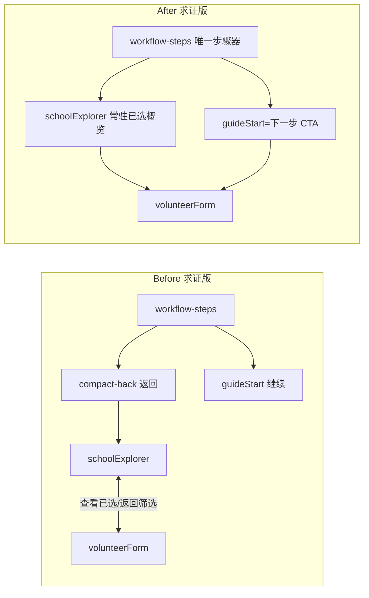

# 广州中考志愿模拟填报系统 · 功能架构与 UI 美化设计文档

> 作者：软件架构师（高见远）  ·  日期：2025-07-24
> 范围：纯原生 HTML/CSS/JS（无构建步骤），浏览器直接打开 `index.html` 运行
> 硬性约束：**engine.js 与 data/ 一律不得修改**，app.js 对 engine.js 的调用点与参数必须原样保留。
> 本文件为「设计产出」，不含实现代码，工程师据此落地。

---

## 一、业务逻辑边界清单（禁区 vs 可优化区）

### 1.1 禁区文件（连一行都不要动）

| 文件 | 性质 | 说明 |
|------|------|------|
| `engine.js` | 投档/录取判断逻辑 | 388 行，22,208 字节 |
| `data/*.json` | 官方数据集 | admissions / allocations-* / schools / score-bands / control-lines / sources / source-schools / manifest |

**engine.js 基线校验和（QA 对照用，改后必须一致）：**
```
SHA256: fc8f643c936aa57bfbbe2926410e7592e877be4f7554743a637f6fedbfbebf60
行数: 388   字节: 22208
```

### 1.2 engine.js 禁区函数 / 常量（全部不得改动）

- 常量：`YEAR_WEIGHTS`、`BATCH_LIMITS`
- 工具函数：`clamp`、`mulberry32`、`triangular`、`weightedYear`、`percentileForScore`、`scoreForPercentile`
- 内部判定：`scopeEligible`、`recordFor`、`selectRecord`、`buildSimulationIndex`、`indexedRecordFor`、`orderedSlots`、`quantile`、`chanceTier`、`firstGap`
- 导出函数（app.js 直接调用）：`gradientIndex`、`candidateTypeFor`、`evaluateRecord`、`replayPlan`、`simulateOutcomes`、`evaluatePlan`

### 1.3 app.js 中必须原样保留的 engine 调用点（参数含固定 seed / iterations）

| 行 | 调用 | 固定参数 |
|----|------|----------|
| L1 | `import { BATCH_LIMITS, evaluatePlan, replayPlan, simulateOutcomes }` | 导入清单不得增删 |
| L30 | `makePlan()` 使用 `BATCH_LIMITS` | `{2:3, 3:6, 4:6}` |
| L233 | `chooseDirectionSchool` 内 `simulateOutcomes(profile,[slot],dataset, 20260722 + batch*100 + position, 600)` | seed 派生、iterations=600 |
| L333 | `generateDirection` 内 `simulateOutcomes(profile, directionDraft, dataset, 20260722, 10000)` | seed=20260722、iter=10000 |
| L334 | `evaluatePlan(profile, directionDraft, directionAnalysis)` | — |
| L442 | `targetChanceAtScore` 内 `simulateOutcomes(scoreProfile,[slot],dataset, 20260817, iterations)` | seed=20260817 |
| L1011 | `analyze` 内 `replayPlan(profile, plan, dataset)` | — |
| L1012 | `analyze` 内 `simulateOutcomes(profile, plan, dataset, 20260722, 10000)` | seed=20260722、iter=10000 |
| L1013 | `evaluatePlan(profile, plan, latestAnalysis)` | — |

> 任何 UI/流程改造都**只能**改「调用前的参数组装」「调用后的渲染展示」「是否调用/何时调用」，不得改上述 seed、iterations 与入参结构。

### 1.4 可优化区文件清单

| 文件 | 可优化内容 |
|------|-----------|
| `index.html` | 三大入口结构、求证版 section 划分、导航元素（global-nav / workflow-steps / compact-back / guideStart）、文案与无障碍属性保留 |
| `app.js` | UI 编排（1416 行）、三大入口「建议生成」UX 函数、导航/衔接逻辑、可视态（loading/disabled）控制 |
| `styles.css` | 全部视觉样式（457 行），引入设计令牌、统一按钮/卡片/表单规范 |
| `navigation.js` | `data-scroll-target` / `data-smart-back` 行为，修复锚点在非 verify 模式失效问题 |
| `special/index.html` `special/special.css` `special/app.js` | 子页视觉一致性、按钮/卡片规范复用 |
| `unlock/index.html` `unlock/unlock.css` `unlock/unlock.js` | 子页视觉一致性、按钮层级、支付按钮状态 |

### 1.5 可重构结构、但必须保持「最终学校建议结果集」一致的函数（app.js）

以下函数属于 UX 建议生成，可调整内部组织/调用，但**输出学校集合须与现版逐位一致**：
`directionScopeEligible`(L187，注意与 engine.scopeEligible 有细微差异，**不要替换为 engine 版**)、`directionPattern`(L194)、`directionCandidates`(L200)、`chooseDirectionSchool`(L223)、`buildDirectionDraft`(L246)、`getDirectionProfile`(L157)、`getTargetProfile`(L359)、`targetEligibleRecords`(L388)、`targetSupportSchools`(L465)、`buildTargetDraft`(L480)、`scoreForTargetChance`(L445)、`targetVolunteerPosition`(L458)、`targetChanceAtScore`(L433)。

> 注：`directionScopeEligible` 使用 `profile.admissionDistrict` 而 engine 版回退到 `schoolDistrict`，二者不等价，重构时务必保留 app.js 现版行为，或经确定性抽样比对确认等价后再替换。

---

## 二、模块组织结构与流程优化

### 2.1 当前模块树（IA）

```
index.html（志愿助手首页）
├─ global-nav（全站导航：志愿助手 / 学校筛选# / 模拟志愿表# / 特长自主招生 / 账户解锁 / 广州招考 / 品沐官网）
├─ intro-strip（首页 hero + 三入口引导 + 真实界面预览）
├─ workspace-switch（三大入口 tab：方向版 / 目标校版 / 求证版）
├─ directionWorkspace（方向版）
│   ├─ directionForm（估分下限/上限/类别/升学区/户籍区/策略/性质）
│   └─ directionResult（stats + groups 冲稳保 + risk switch + 采用草案）
├─ targetWorkspace（目标校版）
│   ├─ targetForm（目标学校/当前估分/类别/区域）
│   └─ targetResult（stats + 历年依据 + 具体建议 + 生成草案）
├─ verifyWorkspace（求证版）
│   ├─ workflow-guide（guideStart「继续」+ workflow-steps 四步器）
│   │     └─ workflow-steps（profile/school/plan/analysis，含 done/active 状态）
│   ├─ profile（STEP1 考生信息 + 进阶偏好 details）
│   ├─ schoolExplorer（STEP2 筛选表 + 已选计数 + 查看已选志愿）
│   ├─ volunteerForm（STEP3 志愿表 + plan-coach 进度 + batchForms×15）
│   └─ analysis（STEP4-5 评分环 + 维度 + 补强清单 + 逐志愿机会 + 去向 + 建议）
├─ disclaimer / quick-return / sourceDialog
special/（特长生与自主招生资格）
unlock/（账户与解锁 / 微信支付）
```

### 2.2 当前导航冗余诊断（实读代码结论）

求证版内部**并存 4 套**用于「步骤间前后跳转」的机制，功能高度重叠：

1. **workflow-steps**（四步器，`data-guide-target` 滚动）→ 主步骤导航。
2. **各 section 内 compact-back**（profile/school/plan/analysis 各自的「← 返回X」）→ 与步骤器重复的水平移动。
3. **guideStart「继续」按钮** → 文案随 activeStep 变化，与步骤器语义一致，冗余。
4. **global-nav 锚点**（「学校筛选」「模拟志愿表」跳 `#schoolExplorer`/`#volunteerForm`）→ 当当前不在 verify 模式时，目标 section 为 `hidden`，`navigation.js` 的 `scrollToTarget` 直接返回 false，点击无作用/跳空（潜在 bug）。

此外：
- **方向版/目标校版 → 求证版衔接有重复计算**：`adoptDirection`/`adoptTarget` 调用 `setWorkspaceMode('verify', true)` 后又立即 `analyze()`，而方向版此前已用 `simulateOutcomes(...,10000)` 算过 `directionAnalysis`；同 seed 下结果与 verify 完全等价，等于白算一遍（性能/体验浪费，不改结果）。
- **schoolExplorer ↔ volunteerForm 来回**：schoolExplorer 有「查看已选志愿」→volunteerForm；volunteerForm 有「← 返回学校筛选」→schoolExplorer。添加学校后要看志愿表必须整页跳转，打断浏览连贯性。
- **方向/目标结果页的「采用」与 verify 重复**：草案在方向版生成一次，带入 verify 再 analyze 一次。

### 2.3 优化后信息架构（推荐）

- **求证版只保留 1 个主步骤器**（workflow-steps），承担 profile→school→plan→analysis 的全部步骤切换与进度展示。
- **移除各 section 内与步骤器重复的 compact-back 水平返回**（profile/school/plan 之间不再用「← 返回X」）；analysis 内的「返回志愿表修改」改为步骤器点 `plan` 即可，或保留为次要文字链。
- **guideStart 保留为「下一步 CTA」**，文案统一为「下一步：X」，与步骤器高亮同步。
- **global-nav 锚点修复**：点击「学校筛选/模拟志愿表」时，若目标 hidden，先 `setWorkspaceMode('verify')` 再滚动（改 `navigation.js` 或拦截点击）。
- **采用草案衔接优化**：`adoptDirection`/`adoptTarget` 将草案 `plan` 与 `profile` 带入 verify，**复用 `directionAnalysis` 作为 `latestAnalysis` 初值**，定位到 `volunteerForm`（而非直接 analysis），由用户主动点「分析」触发重算（可选：因同 seed 等价，可彻底免去重算，直接带出 analysis）。
- **schoolExplorer 常驻「已选 N 所」概览卡**（点击展开 15 志愿缩略），与「查看已选志愿」合并；去掉 volunteerForm 强制「← 返回学校筛选」，改为可选的次要入口，减少整页来回。

详见 `docs/class-diagram.mermaid`（优化后 IA）。

### 2.4 优化前后主流程对比

| 环节 | Before（现状） | After（优化后） |
|------|----------------|------------------|
| 三入口选择 | workspace-tabs 切换，各自独立结果页 | 保留三入口；统一视觉与「采用」衔接 |
| 求证版步骤导航 | workflow-steps + compact-back×N + guideStart 三套并存 | 仅 workflow-steps 主步骤器 + guideStart 作为下一步 CTA |
| 方向/目标→求证 | 采用后 `setWorkspaceMode('verify')` + 立即 `analyze()`（重算一遍） | 带入草稿并复用 directionAnalysis，定位志愿表，按需分析 |
| 学校筛选↔志愿表 | 互跳（查看已选 / 返回筛选） | schoolExplorer 常驻已选概览；返回为可选次要入口 |
| global-nav 锚点 | 非 verify 模式点击失效 | 自动切到 verify 再滚动 |
| 全站按钮层级 | primary/ghost/danger/text 混用、disabled/loading 态不全 | 统一 5 级按钮规范（见 3.2）+ 完整交互态 |

详见 `docs/sequence-diagram.mermaid`（优化后 adopt→verify→analyze 流程）与下方 before/after 流程图。



---

## 三、UI 重设计方案

### 3.1 设计令牌（Design Tokens）—— 落地到 `styles.css` 的 `:root`

以现有蓝（`#0b5cff`）为主色基调，建立可复用的 token 层；现有散落颜色映射进 token，**不改变整体冷暖观感**。

```css
:root {
  /* 主色 / 品牌 */
  --c-brand:        #0b5cff;   /* 主操作 */
  --c-brand-strong: #0646c8;   /* hover/active */
  --c-brand-soft:   #eaf1ff;   /* 主色浅底（按钮浅底、高亮块）*/
  --c-brand-tint:   #f3f7ff;   /* 卡片浅蓝底 */
  --c-navy:         #17233d;   /* 深色顶栏/标题 */

  /* 中性 */
  --c-ink:    #24324a;   /* 正文 */
  --c-ink-2:  #4e5b70;   /* 次级文字 */
  --c-muted:  #68758b;   /* 辅助/说明 */
  --c-line:   #dfe5ee;   /* 边框 */
  --c-line-2: #e7ebf1;   /* 行分隔 */
  --c-surface:#ffffff;   /* 卡片底 */
  --c-canvas: #edf2f8;   /* 页面底 */
  --c-soft:   #f4f7fb;   /* 浅灰底 */

  /* 语义色（成功/警告/危险/信息） */
  --c-success:    #11855b; --c-success-soft: #e8f7f0;
  --c-warning:    #bd6b00; --c-warning-soft: #fff4dc;
  --c-danger:     #c33b45; --c-danger-soft: #fff0f1;
  --c-info:       #0b5cff; --c-info-soft:    #eaf1ff;

  /* 冲稳保 tier（保持现有语义） */
  --tier-reach: var(--c-danger);  --tier-reach-soft: var(--c-danger-soft);
  --tier-match: var(--c-warning); --tier-match-soft: var(--c-warning-soft);
  --tier-safe:  var(--c-success); --tier-safe-soft:  var(--c-success-soft);

  /* 圆角尺度 */
  --r-xs: 6px; --r-sm: 8px; --r-md: 12px; --r-lg: 16px; --r-xl: 20px; --r-pill: 999px;

  /* 间距尺度（4 的倍数） */
  --s-1: 4px; --s-2: 8px; --s-3: 12px; --s-4: 16px; --s-5: 24px; --s-6: 32px; --s-7: 40px;

  /* 字体层级（模块化） */
  --fs-display: 40px; --fs-h1: 28px; --fs-h2: 23px; --fs-h3: 17px;
  --fs-body: 14px;  --fs-sm: 12px;  --fs-xs: 11px;
  --fw-med: 500; --fw-bold: 700; --fw-xbold: 800; --fw-black: 900;

  /* 阴影 / 层级 */
  --e-1: 0 1px 2px rgba(23,35,61,.06), 0 4px 14px rgba(30,52,86,.06);   /* 卡片静止 */
  --e-2: 0 8px 24px rgba(30,52,86,.10);                                  /* 悬浮/强调 */
  --e-3: 0 18px 50px rgba(30,52,86,.12);                                 /* hero/大块 */

  /* 焦点环 */
  --focus-ring: 0 0 0 3px rgba(11,92,255,.35);
  --focus-ring-soft: 0 0 0 3px rgba(124,240,197,.42);  /* 深色顶栏内用 */
}
```

**落地方式**：保留现有类名（`.primary-button` 等）并改为引用 token；新增通用基类 `.btn`/`.card`/`.field` 供子页与重构复用。建议分两步：先在 `:root` 增加 token，再将散落字面量替换为 `var(--…)`，最后用统一 `.btn`/`.card` 收敛组件。

### 3.2 关键组件视觉规范

**（1）按钮（5 级层级，统一交互态）**

| 层级 | 类名 | 用途 | 视觉 |
|------|------|------|------|
| Primary | `.btn .btn--primary` | 主行动（生成/分析/采用） | 实心 `--c-brand`，白字，`--e-2` 阴影 |
| Secondary | `.btn .btn--secondary` | 次主行动（导入/查看已选） | 白底 + `--c-line` 边框 + 深色字 |
| Ghost | `.btn .btn--ghost` | 低强调（清除筛选/返回） | 透明底，仅文字/图标，hover 浅灰 |
| Danger | `.btn .btn--danger` | 破坏性（清空志愿） | `--c-danger-soft` 底 + `--c-danger` 字（**改：加边框与 hover 红底**，当前太弱） |
| Text/Link | `.btn .btn--text` | 文字链（数据来源/退出） | 下划线文字 |

统一交互态（所有 `.btn`）：
```css
.btn { border-radius: var(--r-md); padding: 11px 16px; font-weight: var(--fw-bold);
       transition: background .16s, box-shadow .16s, transform .12s, border-color .16s; }
.btn:hover:not(:disabled)   { transform: translateY(-1px); filter: brightness(.98); }
.btn:active:not(:disabled)  { transform: translateY(0); box-shadow: none; }
.btn:focus-visible          { outline: none; box-shadow: var(--focus-ring); }
.btn:disabled               { cursor: not-allowed; opacity: .55; transform: none; box-shadow: none; }
/* loading：用 data-loading 或 .is-loading 展示 spinner，禁用交互 */
.btn.is-loading::before { content:""; width:14px;height:14px;margin-right:8px;
       border:2px solid currentColor;border-right-color:transparent;border-radius:50%;
       display:inline-block;vertical-align:-2px;animation:btn-spin .6s linear infinite; }
```

**（2）卡片（Card）**
- `.card`：`--c-surface` 底 + `1px var(--c-line)` + `--r-lg` + `--e-1`；内部 padding `--s-4`~`--s-5`。
- 区分「静态卡」(`--e-1`) 与「强调卡/hero」(`--e-3`)。移除当前 3 种不同 blur 半径的阴影，统一为 `--e-1/--e-2/--e-3`。
- 分组用 `--c-soft`/`--c-brand-tint` 浅底块替代纯白，降低视觉噪声。

**（3）表单（Form / Field）**
- `.field` 统一 label 网格（`gap: var(--s-2)`），label 用 `--fs-sm`/`--fw-bold`/`--c-ink-2`。
- `input/select` 统一 `height:42px`、`--r-sm`、`1px var(--c-line)`，hover `--c-line` 加深，focus `var(--focus-ring)`。
- 必填/选填用 `*` 与 muted 提示，不在 label 里塞长句（长说明移到 `small` 或用 tooltip/展开）。

**（4）表格（Table）**
- `school-table` 表头 sticky、行 hover 浅底（`--c-soft`）；`th/td` 对齐、留白用 `--s-3`。
- 「加入」按钮用 `.btn--secondary` 小尺寸；已选态用 `.btn--ghost` + success 文字（保持现状语义，但视觉统一）。

**（5）步骤器 / 进度指示（Stepper）**
- 收敛为唯一 `.stepper`：`profile→school→plan→analysis` 四步，三态 `todo/active/done`。
- `active`：`--c-brand` 文字 + `--c-brand-soft` 底 + 蓝点；`done`：`--c-success` + 绿点；`todo`：灰点灰字。
- 与 `guideStart` CTA 联动：CTA 文案 = 「下一步：{activeStep 的下一站}」。

**（6）评分环 / 进度（Score Ring & Track）**
- `score-ring` 用 `conic-gradient(--c-brand …)` 不变；增加「维度卡片」统一为 `.card` 小尺寸。
- `chance-track` 进度条用 `--c-brand`，区间文字 `--fs-sm`。

### 3.3 需要调整的现有视觉问题清单（按文件）

**`styles.css`（主站）**
1. `.danger-button`（L68）仅浅红底红字、无 hover/border/active，破坏层级 → 改 `.btn--danger` 规范。
2. `.compact-back`（L73）无 hover/focus 态，且承担「返回」语义与步骤器重复 → 收敛（见 2.2）。
3. `button:hover { transform: translateY(-1px) }`（L69）对所有按钮生效，含 `.compact-back`/`.add-school`/`.row-actions` 小按钮，位移显得奇怪 → 仅 `.btn` 主/次按钮应用。
4. 阴影不统一：hero 用 `--shadow`(50px)、panel 用 32–34px 两种 → 统一为 `--e-1/--e-2/--e-3`。
5. 圆角字号无尺度：intro 20 / workspace 15 / panel 16 / 卡片 13/11… 散落 → 映射到 `--r-*`。
6. 间距用任意 px（14/22/24/28）→ 映射到 `--s-*`。
7. 字体无层级表：10–40px 随意 → 映射 `--fs-*`。
8. `.guide-start-button`/`.add-school`/`.improvement-points button` 各自一套蓝底浅蓝，缺乏统一按钮基 → 收归 `.btn`。
9. focus 环混用 teal(`--focus-ring-soft`) 与无 → 统一为 `--focus-ring`（深色顶栏内用 soft）。
10. `plan-coach`（L241）三栏 Grid 在中等屏易挤压 → 优化断点。

**`index.html`**
11. workspace-switch 与 workflow-guide 与 intro-strip 三个顶部区块叠加，首屏信息密度高 → 适当留白/分组。
12. `direction-form` 6/7 列网格在小屏标签拥挤 → 表单栅格用 token 间距并优化断点。
13. 重复文案/无障碍属性需保留：所有 `aria-label`/`role`/`aria-selected`/`aria-controls` 不得丢失（重构时逐项核对）。

**`special/special.css`、`unlock/unlock.css`**
14. 子页按钮复用主站类但各自实现（`.select-autonomous-school`、`.pay-button`、`.hero-back`）→ 改用统一 `.btn` 体系，保持各自语义色。
15. 子页卡片/表单与主站 token 未打通（直接写 `#0d5cf0` 等）→ 引用主站 `--c-brand` 等，保证全站一致。

---

## 四、任务分解列表（有序、含依赖）

> 约束：纯静态站点无构建步骤，故「基础设施」任务 reinterpret 为「设计令牌与基础组件层」，是所有后续任务的唯一前置。共 5 个任务，每任务 ≥3 文件。

| Task | 名称 | 涉及文件（相对路径） | 依赖 | 优先级 |
|------|------|----------------------|------|--------|
| **T01** | 设计令牌与基础组件层 | `styles.css`、`special/special.css`、`unlock/unlock.css`、`index.html`(头部变量) | — | P0 |
| **T02** | 主站信息架构与导航收敛 | `index.html`、`app.js`、`navigation.js` | T01 | P0 |
| **T03** | 主站核心模块视觉提升 | `styles.css`、`app.js`(render*)、`index.html` | T01 | P1 |
| **T04** | 子页视觉一致性 | `special/index.html`、`special/special.css`、`special/app.js`、`unlock/index.html`、`unlock/unlock.css`、`unlock/unlock.js` | T01 | P1 |
| **T05** | 流程顺滑化 + 衔接优化 + 回归校验 | `app.js`、`index.html`、`engine.js`(仅校验不动)、`docs/qa-check.md`(新增) | T01,T02,T03 | P1 |

**各任务具体改什么（工程师可直接落地）：**

**T01 设计令牌与基础组件层**
- 在 `styles.css` `:root` 追加 §3.1 全部 token；将现有字面量（蓝/灰/圆角/阴影/间距）逐步替换为 `var(--…)`。
- 新增通用基类：`.btn` 及 `.btn--primary/--secondary/--ghost/--danger/--text`、`.btn.is-loading`、`.card`/`.card--raised`、`.field`、`@keyframes btn-spin`。
- `special/special.css`、`unlock/unlock.css` 顶部 `@import` 或复制同一套 token（因子页独立加载 `../styles.css`，可直接复用主站变量，无需复制）；子页既有色值改为引用。

**T02 主站信息架构与导航收敛**
- `index.html`：移除 profile/school/plan/analysis 内与步骤器重复的 `compact-back` 水平返回按钮（保留 analysis→志愿表的可选次要文字链）；`guideStart` 文案改为「下一步：X」。
- `app.js`：`updateWorkflowGuide` 保留；`renderSchoolTable`/`renderBatchForms` 相关 compact-back 的绑定清理；`guideStart` 文案随 `activeStep` 同步。
- `navigation.js`：处理 `data-scroll-target` 时，若目标 `hidden`，先尝试 `setWorkspaceMode('verify')`（通过 `window` 暴露的切换函数）再滚动；避免非 verify 模式点击失效。

**T03 主站核心模块视觉提升**
- `styles.css`：profile 表单、school-table、volunteer-row、score-ring/dimension、improvement-card、direction/target result 全部改用 T01 的 `.btn`/`.card`/token（落地 §3.2 与 §3.3 的 1–10 项）。
- `app.js`：`generateDirection`/`switchDirectionRisk`/`autoImprovePlan` 中 loading 态改用 `.btn.is-loading`；按钮渲染统一类名。
- `index.html`：表单栅格断点用 token 间距优化；保留全部文案与 `aria-*`。

**T04 子页视觉一致性**
- `special/*`、`unlock/*`：按钮/卡片/表单改用统一 `.btn`/`.card`/`.field`；`.select-autonomous-school`、`.pay-button`、`.hero-back` 收归规范但保留语义色；子页与主站视觉一致。
- 保留子页文案与 `aria-*`（如 `aria-selected`、`role="tab"`）。

**T05 流程顺滑化 + 衔接优化 + 回归校验**
- `app.js`：`adoptDirection`/`adoptTarget` 将草案 `plan` 与 `profile` 带入 verify 后，**复用 `directionAnalysis` 作为 `latestAnalysis` 初值**，定位到 `volunteerForm`，由用户点「分析」触发（因同 seed 等价，可彻底免重算）；移除自动 `analyze()`。
- `app.js` + `index.html`：schoolExplorer 增加常驻「已选 N 所」概览卡（点击展开 15 志愿缩略），合并「查看已选志愿」；volunteerForm 的「← 返回学校筛选」降级为可选次要入口。
- `docs/qa-check.md`：写入 §五 的回归脚本与对照清单（engine.js 校验和、node 确定性抽样、调用点 grep、建议结果集比对）。

---

## 五、给 QA 的回归指引（engine.js 与 data/ 不动，如何验证业务逻辑未变）

### 5.1 engine.js 字节 / 校验和不变（最硬指标）
```bash
# Windows
certutil -hashfile engine.js SHA256
# 期望: fc8f643c936aa57bfbbe2926410e7592e877be4f7554743a637f6fedbfbebf60
# 行数 388 / 字节 22208 也必须一致
```
> 任何改动后只要 engine.js 校验和变化 = 违规，立即回滚。

### 5.2 改后 JS 语法检查
```bash
node --check engine.js
node --check app.js
node --check navigation.js
node --check special/app.js
node --check unlock/unlock.js
```
> `import/export` 为合法语法，`node --check` 可校验（不执行）。全部须 0 错误。

### 5.3 engine.js 抽样确定性验证（纯函数 + 固定 seed）
写临时 `qa/verify-engine.mjs`（仅验证用，不进生产）：
```js
import { simulateOutcomes, replayPlan, evaluatePlan } from '../engine.js';

const profile = { mode:'forecast', targetYear:2027, score:710, scoreLow:700, scoreHigh:720,
  tieRank:null, candidateType:'户籍生', admissionDistrict:'天河区', householdDistrict:'天河区',
  schoolDistrict:'天河区', sourceSchoolId:'', referenceGrade:'C', riskPreference:'均衡',
  ownershipPreference:'不限', boardingPreference:'不限', maxAnnualFee:null,
  preferredDistricts:['天河区'], excludedSchools:[], crossDistrict:false,
  quotaEligible:false, notAdmittedFirstBatch:true };

// 构造 15 槽中若干学校（用真实 schoolId 占位）
const plan = [ /* b3-1..b4-6，填 3 个真实 schoolId */ ];
const ds = { admissions:[/*来自 data/admissions.json 子集*/], allocations:[],
  lines:{}, bands:[], manifest:{ years:[2021,2022,2023,2024,2025,2026], latestPolicyYear:2026 } };

const out = simulateOutcomes(profile, plan, ds, 20260722, 10000);
console.log(JSON.stringify(out.slotResults.map(r=>[r.batch,r.position,r.chance,r.tier])));
```
> 回归时重跑，输出 JSON 必须与改前基线逐位一致（seed 固定 → 结果可复现）。replayPlan 同理用 `mode:'replay'`。

### 5.4 调用点守恒（grep）
```bash
grep -n "simulateOutcomes\|evaluatePlan\|replayPlan\|BATCH_LIMITS\|from './engine.js'" app.js
```
> 须与 §1.3 表格完全一致：seed `20260722`（主）、`20260817`（目标校）、`20260722+batch*100+position`（方向筛选）；iterations `10000`/`600`/`350|800|1200`；导入清单不变。

### 5.5 建议结果集不变（方向/目标校最终学校集合）
```bash
# 改前：构造相同输入，导出 adoptDirection 后的 plan.schoolId 序列快照
# 改后：同样输入再导出一次，diff 比对
node qa/snapshot-direction.mjs   # 输出 JSON: [batch,position,schoolId]
```
> 方向版 `buildDirectionDraft`、目标校版 `buildTargetDraft` 的最终 `schoolId` 集合须逐位一致（这些函数在 app.js 可重构，但结果必须不变）。

### 5.6 全站功能冒烟 + 文案/无障碍守恒
- 三大入口各跑一遍；求证四步（profile→school→plan→analysis）走通；导出/导入/打印可用。
- 子页（special/unlock）主流程可用。
- 对照 `assets/previews/*.webp` 真实截图人工比对关键界面。
- diff 检查：所有 `aria-label`/`role`/`aria-selected`/`aria-controls`/`aria-current` 不得丢失或错配（重构导航时重点核对）。

---

## 六、待明确事项（需用户拍板的设计取向，均附推荐项）

1. **配色冷暖**：现状蓝（冷）。是否保持蓝、转暖（青绿/橙）、或做品牌色升级？
   → **推荐**：保持蓝主色，提升中性层次与语义色规范（已体现在 §3.1），不改冷暖观感、风险最低。
2. **三入口模式是否保留**：保留 / 合并为单一向导？
   → **推荐**：保留三入口（契合「先说你知道多少」定位），仅统一视觉与「采用」衔接。
3. **采用草案后的落点**：带入 verify 后定位到「志愿表」还是直接「分析完成」？
   → **推荐**：定位到志愿表，由用户主动分析（更顺、且可免去一次等价重算，见 T05）。
4. **schoolExplorer ↔ volunteerForm 布局**：轻改（常驻已选概览）/ 大改（两栏并排）？
   → **推荐**：轻改（常驻概览，工作量小、风险低）；两栏并排列入后续可选增强。
5. **设计落地方式**：仅引入 token + 复用现有类 / 还是重写组件类？
   → **推荐**：引入 token 层 + 统一 `.btn`/`.card`/`.field` 基类，保留现有结构，避免重写导致的回归风险。
6. **字体**：现状 Inter + PingFang/雅黑（Inter 非中文优化）。是否替换为系统中文字体栈？
   → **推荐**：保留现状字体栈，仅规范 `--fs-*` 层级；如需更佳中文观感可后续评估。

---
> 附图：`docs/class-diagram.mermaid`（优化后 IA）、`docs/sequence-diagram.mermaid`（优化后关键流程）。
