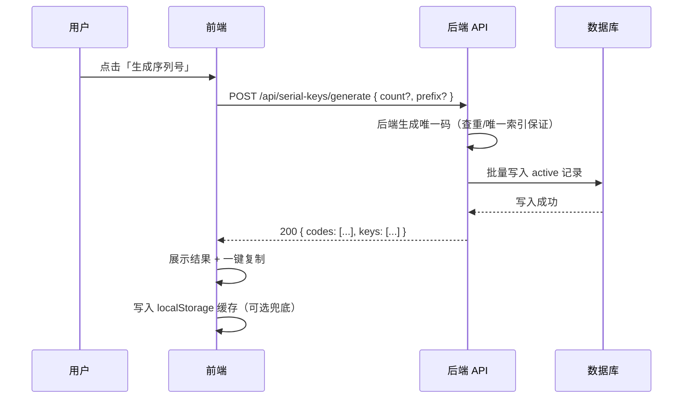
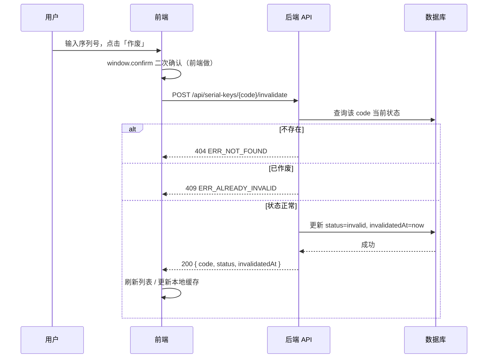

# 序列号生成器 · 后端对接 API 接口规范

> 文档状态：已实现契约（v1.1）
> 适用系统：序列号生成器前端（纯前端版） ↔ 序列号后台系统（目标后端）
> 维护角色：架构师 — 高见远（Gao）

---

## 1. 概述与范围

### 1.1 当前前端现状

序列号生成器目前为**纯前端 + localStorage**实现，代码位于 `serial-key/` 目录（`index.html` / `styles.css` / `app.js`），**尚无后端服务**。核心事实如下（已与源码核对）：

| 项 | 现状（来自源码 `app.js`） |
| --- | --- |
| 持久化 | `localStorage`，key 为 `zk_serial_keys`，存储**数组** |
| 单条记录结构 | `{ code: string, status: 'active' \| 'invalid', createdAt: number(ms 时间戳), invalidatedAt: number \| null }` |
| 序列号规则 | 固定 **10 位**；字符集 `23456789ABCDEFGHJKMNPQRSTUVWXYZ`（共 31 个字符，已排除易混字符 `0 / O / 1 / I / L`） |
| 唯一性保证 | 前端生成时查重（`generateUniqueCode`），最多重试 `MAX_RETRY = 100` 次 |
| 生成功能 | 点击按钮生成 1 条，结果展示区支持「复制」 |
| 作废功能 | 手动输入或点选有效序列号 → 前端 `window.confirm` 二次确认 → 标记 `invalid` 并记录 `invalidatedAt` |
| 列表功能 | 表格展示全部记录，支持按 `全部 / 有效 / 已作废` 筛选；**倒序**展示（最新在前） |
| 系统入口 | 占位 `<a href="/">进入中考模拟系统</a>`，当前未对接任何真实系统 |
| 认证 | **无**。前端未实现任何鉴权逻辑 |

### 1.2 本文档范围

本文档定义**目标后端 REST API 契约**，用于：

1. 将前端从 localStorage 读写**迁移为调用后端接口**；
2. 与**独立的序列号后台系统**进行集成对接（生成、作废、核销、查询）；
3. 统一数据模型、接口规范、认证方式与错误码，作为前后端联调与第三方系统接入的依据。

> 实施说明：生成器已迁移为服务端接口；`localStorage` 不再存储序列号或使用权。管理接口使用 `SERIAL_ADMIN_API_KEY` 的 `X-API-Key` 请求头，密钥仅应配置在服务端环境变量或内部管理者当次浏览器会话中。

### 1.3 约定

- Base URL：`https://<后端域名>/`（本地开发可用 `http://localhost:<port>/`，前后端约定后填入）
- 数据格式：请求与响应均为 `application/json; charset=utf-8`
- 时间字段：UTC 毫秒时间戳（`number`），与现有前端 `Date.now()` 保持一致；响应中同时提供可选 ISO 字符串字段（见数据模型）
- 字符集：序列号仅含 `23456789ABCDEFGHJKMNPQRSTUVWXYZ`，大小写不敏感（请求统一转大写）

---

## 2. 核心功能模块

| 模块 | 功能 | 对应接口 | 现有前端对应 |
| --- | --- | --- | --- |
| 序列号生成 | 生成 1 条或多条唯一序列号，保证全局唯一 | `POST /api/serial-keys/generate` | 「生成序列号」按钮 + 复制 |
| 序列号作废 | 将指定有效序列号置为 `invalid` 并记录作废时间 | `POST /api/serial-keys/{code}/invalidate` | 「作废序列号」输入 + confirm |
| 列表查询 | 分页 + 状态筛选，返回序列号列表 | `GET /api/serial-keys` | 「序列号列表」表格 + 筛选 chips |
| 单条查询/校验 | 查询单条状态，或校验有效性 | `GET /api/serial-keys/{code}` | （前端暂无，后台/外部系统用） |
| 批量/单条核销校验 | 外部系统批量校验有效性（如中考模拟系统核销） | `POST /api/serial-keys/validate` | 系统入口占位 `href="/"` 后续对接 |
| 系统入口占位 | 占位入口，后续替换为真实系统集成地址 | —（前端路由） | `<a href="/">` |

---

## 3. 数据模型

### 3.1 设备绑定与用户解锁

- 一个有效序列号最多绑定 **2 台不同设备**；同一设备再次验证不会增加数量。
- 第 3 台设备调用解锁接口返回 `409`、错误码 `SERIAL_DEVICE_LIMIT`，需使用新的序列号。
- 服务端仅保存设备标识的 HMAC 摘要，不保存设备名称、手机号或其他身份信息。
- 解锁成功后写入 HttpOnly Cookie，`GET /api/access/auth/check` 返回 `204`。

#### `POST /api/access/serial/redeem`

请求必须来自允许的站点 Origin。

```json
{ "code": "ABCDEFGHJK", "deviceId": "550e8400-e29b-41d4-a716-446655440000" }
```

成功响应：

```json
{ "ok": true, "entitled": true, "deviceCount": 1, "maxDevices": 2, "expiresInDays": 180 }
```

第三台设备响应：

```json
{ "error": "该序列号已绑定两台设备；第 3 台设备需要使用新的序列号。", "code": "SERIAL_DEVICE_LIMIT", "deviceCount": 2, "maxDevices": 2 }
```

### 3.2 序列号记录（SerialKey）

| 字段 | 类型 | 必返 | 说明 |
| --- | --- | --- | --- |
| `code` | string | 是 | 序列号，10 位，字符集 `23456789ABCDEFGHJKMNPQRSTUVWXYZ`；全局唯一 |
| `status` | string(enum) | 是 | 状态：`active`（有效）/ `invalid`（已作废） |
| `createdAt` | number | 是 | 创建时间，UTC 毫秒时间戳 |
| `createdAtISO` | string | 否 | 创建时间 ISO 8601 字符串（如 `2026-07-26T08:30:00.000Z`），便于调试 |
| `invalidatedAt` | number \| null | 是 | 作废时间，UTC 毫秒时间戳；未作废时为 `null` |
| `invalidatedAtISO` | string \| null | 否 | 作废时间 ISO 8601 字符串；未作废时为 `null` |

> 与现有前端结构保持一致：前端记录即 `{ code, status, createdAt, invalidatedAt }`，新增 `*ISO` 为可选调试字段，不影响现有字段语义。

### 3.3 状态枚举

| 状态值 | 含义 | 流转 |
| --- | --- | --- |
| `active` | 有效，可使用/可核销 | 初始状态；生成时置为 `active` |
| `invalid` | 已作废，不可再用 | 由 `active` 经作废接口流转，不可逆 |

### 3.4 分页响应结构（Pagination）

| 字段 | 类型 | 说明 |
| --- | --- | --- |
| `list` | SerialKey[] | 当前页记录数组（默认倒序，最新在前，与前端一致） |
| `page` | number | 当前页（从 1 开始） |
| `pageSize` | number | 每页条数 |
| `total` | number | 满足筛选条件的总记录数 |
| `totalPages` | number | 总页数 |

---

## 4. 数据流程图

### 4.1 序列号生成流程



### 4.2 序列号作废流程



### 4.3 列表查询流程（分页 + 筛选）


### 4.4 单条校验 / 外部核销流程

```mermaid
flowchart LR
    G[外部系统/前端] --> H[GET /api/serial-keys/{code} 或 POST /api/serial-keys/validate]
    H --> I[后端: 查库 + 状态校验]
    I --> J{status == active?}
    J -->|是| K[返回 valid: true]
    J -->|否/不存在| L[返回 valid: false + 原因]
```

### 4.5 前端 localStorage 迁移到 API 的改造点

| 原有实现（localStorage） | 改造目标（API） | 改造要点 |
| --- | --- | --- |
| `loadKeys()` 读 `zk_serial_keys` | 调用 `GET /api/serial-keys` | 列表/筛选改为带 `page/pageSize/status` 的分页请求；保留 localStorage 作**离线缓存** |
| `saveKeys()` 写 `zk_serial_keys` | 调用 `POST .../generate`、`POST .../invalidate` | 写操作改为请求后端，成功后以响应数据为准刷新视图 |
| `generateUniqueCode()` 前端查重 | 后端保证唯一 | 删除前端查重逻辑；后端用唯一索引/原子生成兜底 `ERR_DUPLICATE` |
| `window.confirm` 二次确认 | 保留在前端 | 二次确认语义不变（前端交互），后端做状态校验 |
| `normalizeCode()` 转大写 | 请求前统一转大写 | 保持不变，保证请求体大小写一致 |
| 列表倒序展示 | 响应 `list` 默认倒序 | 与前端一致；分页后由后端排序 |

---

## 5. API 接口规范

> 公共请求头（除登录/公开接口外，所有接口均需认证，见第 6 节）：
> - `Content-Type: application/json`
> - `Authorization: Bearer <token>` **或** `X-API-Key: <key>`

### 5.1 生成序列号

- **方法 / 路径**：`POST /api/serial-keys/generate`
- **功能描述**：生成 1 条或多条唯一序列号并落库，状态为 `active`。唯一性由后端保证（建议数据库对 `code` 建唯一索引，生成冲突时重试或返回 `ERR_DUPLICATE`）。
- **请求头**：`Authorization` / `X-API-Key` 二选一；`Content-Type: application/json`
- **请求体参数**：

| 字段 | 类型 | 必填 | 说明 |
| --- | --- | --- | --- |
| `count` | number | 否 | 生成数量，默认 `1`，建议上限 `100` |
| `prefix` | string | 否 | 前缀，可选；仅含安全字符集字符，拼接到 10 位码之前或作为规则前缀（前后端约定；若启用，总长需另行约定） |

- **成功响应**：`200 OK`

```json
{
  "codes": ["K7M2P9Q3AB", "B4R8T6W2XC"],
  "keys": [
    {
      "code": "K7M2P9Q3AB",
      "status": "active",
      "createdAt": 1785034800000,
      "createdAtISO": "2026-07-26T08:30:00.000Z",
      "invalidatedAt": null,
      "invalidatedAtISO": null
    },
    {
      "code": "B4R8T6W2XC",
      "status": "active",
      "createdAt": 1785034800100,
      "createdAtISO": "2026-07-26T08:30:00.100Z",
      "invalidatedAt": null,
      "invalidatedAtISO": null
    }
  ]
}
```

### 5.2 作废序列号

- **方法 / 路径**：`POST /api/serial-keys/{code}/invalidate`
- **功能描述**：将指定序列号置为 `invalid` 并记录 `invalidatedAt`。二次确认由前端完成，后端负责状态校验（不存在 / 已作废返回对应错误）。
- **路径参数**：

| 参数 | 类型 | 必填 | 说明 |
| --- | --- | --- | --- |
| `code` | string | 是 | 目标序列号（10 位，大小写不敏感，后端统一转大写） |

- **请求头**：`Authorization` / `X-API-Key`
- **请求体**：无（或空对象 `{}`）
- **成功响应**：`200 OK`

```json
{
  "code": "K7M2P9Q3AB",
  "status": "invalid",
  "createdAt": 1785034800000,
  "createdAtISO": "2026-07-26T08:30:00.000Z",
  "invalidatedAt": 1785038400000,
  "invalidatedAtISO": "2026-07-26T09:30:00.000Z"
}
```

### 5.3 列表查询（分页 + 筛选）

- **方法 / 路径**：`GET /api/serial-keys`
- **功能描述**：分页返回序列号列表，支持按状态筛选；默认倒序（最新在前），与前端展示一致。
- **Query 参数**：

| 参数 | 类型 | 必填 | 说明 |
| --- | --- | --- | --- |
| `page` | number | 否 | 页码，从 `1` 开始，默认 `1` |
| `pageSize` | number | 否 | 每页条数，默认 `20`，上限建议 `100` |
| `status` | string | 否 | 状态筛选：`active` / `invalid`；不传或 `all` 表示全部 |

- **请求头**：`Authorization` / `X-API-Key`
- **成功响应**：`200 OK`

```json
{
  "list": [
    {
      "code": "K7M2P9Q3AB",
      "status": "active",
      "createdAt": 1785034800000,
      "createdAtISO": "2026-07-26T08:30:00.000Z",
      "invalidatedAt": null,
      "invalidatedAtISO": null
    }
  ],
  "page": 1,
  "pageSize": 20,
  "total": 1,
  "totalPages": 1
}
```

### 5.4 单条查询 / 校验有效性

- **方法 / 路径**：`GET /api/serial-keys/{code}`
- **功能描述**：查询单条序列号完整信息及有效性（供前端详情、外部系统校验）。
- **路径参数**：

| 参数 | 类型 | 必填 | 说明 |
| --- | --- | --- | --- |
| `code` | string | 是 | 目标序列号（大小写不敏感） |

- **成功响应**：`200 OK`

```json
{
  "code": "K7M2P9Q3AB",
  "status": "active",
  "createdAt": 1785034800000,
  "createdAtISO": "2026-07-26T08:30:00.000Z",
  "invalidatedAt": null,
  "invalidatedAtISO": null,
  "valid": true
}
```

### 5.5 批量 / 单条校验有效性（核销）

- **方法 / 路径**：`POST /api/serial-keys/validate`
- **功能描述**：供外部系统（如中考模拟系统）批量核销/校验序列号有效性。已作废或不存在返回 `valid: false` 并附原因。
- **请求头**：`Authorization` / `X-API-Key`
- **请求体参数**：

| 字段 | 类型 | 必填 | 说明 |
| --- | --- | --- | --- |
| `codes` | string[] | 是 | 待校验的序列号数组（1~N 条） |

- **成功响应**：`200 OK`

```json
{
  "results": [
    { "code": "K7M2P9Q3AB", "valid": true,  "status": "active",   "reason": null },
    { "code": "ZZZZZZZZZZ",  "valid": false, "status": "invalid",  "reason": "INVALIDATED" },
    { "code": "NOPE123456",  "valid": false, "status": null,       "reason": "NOT_FOUND" }
  ]
}
```

> `reason` 取值：`NOT_FOUND`（不存在）/ `INVALIDATED`（已作废）/ `USED`（如未来扩展已使用状态）。

---

## 6. 认证方式

### 6.1 现状与约束

当前前端**未实现任何认证**。对接后台系统时，前后端需约定统一鉴权方案。本文档预留两种可选方式，**至少启用其一**：

| 方案 | 请求头 | 适用场景 | 说明 |
| --- | --- | --- | --- |
| API Key | `X-API-Key: <key>` | 服务端到服务端、内部系统调用 | 简单；key 由后台签发，可按来源区分权限 |
| Bearer Token | `Authorization: Bearer <token>` | 用户登录态、前端浏览器调用 | 推荐用于前端；token 由登录/鉴权服务签发（JWT 等） |

### 6.2 推荐做法

1. **前端 ↔ 后台**：采用 `Authorization: Bearer <token>`。前端在登录后从鉴权服务获取 token 并缓存（内存/localStorage），每次请求附带；token 过期用刷新机制续期。
2. **外部系统（中考模拟系统）核销**：采用 `X-API-Key`，按调用方分配独立 key，后端做来源与频次限制。
3. **HTTPS 强制**：所有接口必须走 HTTPS，避免密钥/ token 明文泄露。
4. **迁移过渡**：后端就绪前，前端保留 localStorage 实现且无需认证；切换时通过配置开关（`USE_BACKEND = true` + `API_BASE`）平滑过渡，避免硬编码。

---

## 7. 错误码列表

### 7.1 统一错误响应结构

所有错误响应体统一为：

```json
{
  "error": {
    "code": "ERR_XXXX",
    "message": "人类可读的错误描述（中文）",
    "detail": { }
  }
}
```

- `code`：机器可读的错误码（见下表）
- `message`：面向开发/运维的中文描述
- `detail`：可选，附加上下文（如字段名、冲突值）

### 7.2 错误码表

| 错误码 | HTTP 状态 | 说明 | 触发场景 |
| --- | --- | --- | --- |
| `ERR_BAD_REQUEST` | 400 | 参数错误 | 请求体/参数缺失、类型错误、`count` 超出上限、`code` 长度/字符集不符 |
| `ERR_NOT_FOUND` | 404 | 序列号不存在 | 作废/查询的 `code` 在库中不存在 |
| `ERR_ALREADY_INVALID` | 409 | 序列号已作废 | 对已 `invalid` 的码再次调用作废 |
| `ERR_ALREADY_USED` | 409 | 序列号已使用 | （若未来扩展 `used` 状态）对已使用的码操作 |
| `ERR_DUPLICATE` | 409 | 序列号冲突 | 后端生成时与已有码冲突且重试失败（理论上靠唯一索引避免） |
| `ERR_UNAUTHENTICATED` | 401 | 未认证 | 缺 `Authorization` / `X-API-Key` 或 token 无效/过期 |
| `ERR_FORBIDDEN` | 403 | 无权限 | 已认证但无该接口/资源访问权限（如外部 key 越权） |
| `ERR_RATE_LIMITED` | 429 | 频率限制 | 触发接口限流（生成/校验高频调用） |
| `ERR_INTERNAL` | 500 | 服务器错误 | 后端未预期异常、数据库故障等 |

### 7.3 错误响应示例

```json
{
  "error": {
    "code": "ERR_ALREADY_INVALID",
    "message": "该序列号已处于作废状态，无法重复作废",
    "detail": { "code": "K7M2P9Q3AB" }
  }
}
```

---

## 8. 前端改造指引（从 localStorage 迁移到 API）

> 目标：业务逻辑与 UI 不变，仅将持久化层从 localStorage 替换为后端 API；localStorage 降级为**缓存 / 离线兜底**。

1. **新增 API 客户端层**
   - 新建 `api.js`（或并入 `app.js`），封装 `request(method, path, body)`，统一附加认证头、处理 `{ error }` 结构、抛出标准化错误。
   - 配置 `const API_BASE = 'https://<后端域名>'; const USE_BACKEND = true;`（开关控制迁移节奏）。

2. **替换持久化函数**
   - `loadKeys()` → 调用 `GET /api/serial-keys?page&pageSize&status`；首次加载或离线时回退读取 `zk_serial_keys` 缓存。
   - 生成按钮 → 调用 `POST /api/serial-keys/generate`（删掉 `generateUniqueCode` 前端查重）；成功后以响应 `keys` 刷新视图，并写回 localStorage 缓存。
   - 作废按钮 → 保留 `window.confirm` 二次确认；确认后调用 `POST /api/serial-keys/{code}/invalidate`，按 `ERR_*` 提示对应错误。

3. **保留不改变的部分**
   - `normalizeCode()` 转大写、列表倒序展示、`status` 文案映射（`active`→有效 / `invalid`→已作废）、`formatTime()` 展示。
   - `<a href="/">` 系统入口占位：后端/外部系统对接后替换为真实地址（如中考模拟系统核销页）。

4. **错误处理对齐**
   - 捕获 API 返回的 `error.code`，映射为现有 `showToast(...)` 提示；`ERR_UNAUTHENTICATED` 引导登录，`ERR_RATE_LIMITED` 提示稍后重试。

5. **离线兜底策略（可选）**
   - 网络异常时仍可读 `zk_serial_keys` 展示历史数据；写操作失败提示「网络异常，稍后重试」，不在离线态伪造写成功。

---

## 附录 A：与现有前端一致的关键点核对

| 维度 | 前端现状 | 本文档约定 |
| --- | --- | --- |
| 存储 key | `zk_serial_keys` | 仅作为前端缓存 key，后端表名自定 |
| 记录字段 | `code / status / createdAt / invalidatedAt` | 完全一致，新增 `*ISO` 可选字段 |
| 状态枚举 | `active` / `invalid` | 一致，预留 `used` 扩展 |
| 序列号规则 | 10 位，字符集 `23456789ABCDEFGHJKMNPQRSTUVWXYZ` | 一致（生成逻辑移至后端） |
| 列表倒序 | 最新在前 | `GET` 响应 `list` 默认倒序 |
| 作废流程 | 前端 confirm + 标记 invalid | confirm 在前端，状态校验在后端的 |
| 系统入口 | `<a href="/">` 占位 | 预留外部核销接口 `POST /api/serial-keys/validate` |

## 附录 B：文档版本

- v1.0（2026-07-26）— 初版对接契约，由架构师高见远（Gao）编制。
