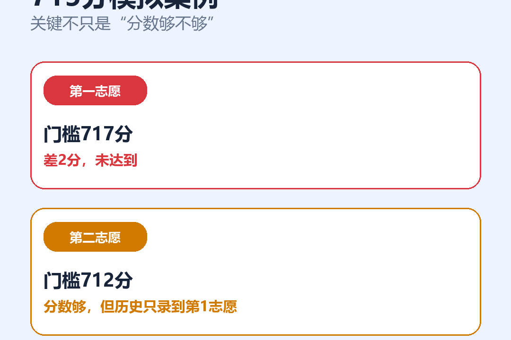
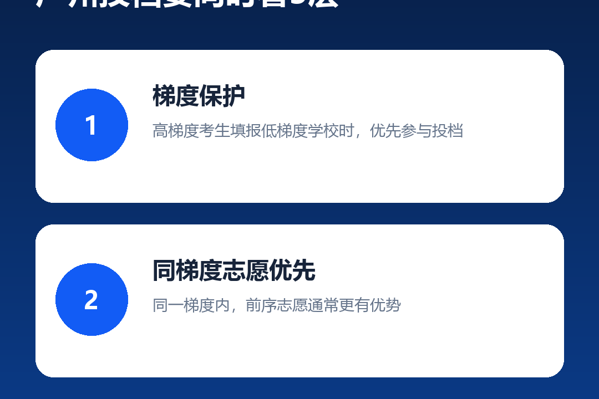
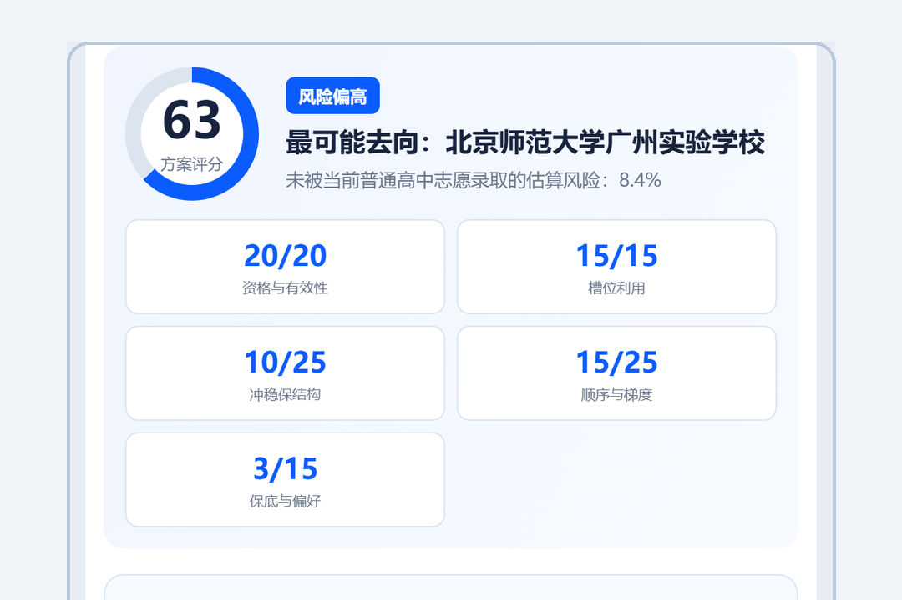

# 2026-07-27 四平台发布文案

核心主题：715分过线，第二志愿为什么仍可能落选？

## 小红书

标题：715分过线，第二志愿仍可能落选？

正文：

很多家长看学校时，只盯着一个数字：最低录取分。

但在广州中考投档里，“分数超过最低分”不等于“填在任何志愿位置都能录取”。

举个模拟案例：

第一志愿门槛717分，考生715分，没有达到。

第二志愿门槛712分，看起来分数够了；但该校历史录取结果只录到第一志愿，填在第二志愿仍可能落选。

第三志愿门槛698分，考生处于更高梯度，才可能因为梯度保护形成录取机会。

所以排志愿时至少要同时看三层：

1. 梯度保护：高梯度考生填报低梯度学校时，优先参与投档。
2. 同梯度志愿优先：同一梯度内，前序志愿通常更有优势。
3. 分数择优：同梯度、同志愿序号内，再比较成绩和同分序号。

广州中考志愿模拟助手的作用，不是替家长“猜中结果”，而是把这些规则和历年门槛放进同一张方案里：

- 只知道估分，可先生成冲稳保方向；
- 有目标学校，可倒推建议分值和志愿位置；
- 已经排好方案，可检查资格、顺序、梯度和保底结构。

系统给出的概率区间、方案合理度和调整建议，均为依据公开政策与历史数据的统计估计。

需要体验或了解购买方式，可以私信咨询。淘宝/闲鱼上架后，通过正规订单获取序列号，再到官网输入序列号解锁。

仅供参考，不代表官方录取结果或任何录取承诺，请以当年广州招考部门最终公布的信息为准。

标签：#广州中考 #中考志愿 #广州升学 #志愿填报 #中考家长 #梯度保护 #品沐咨询

内容类型声明：笔记含AI合成内容

配图顺序：`xiaohongshu/01` 至 `xiaohongshu/07`

## 抖音

标题：715分超过最低分，第二志愿为什么仍可能落选？

发布文案：

广州中考不是只看最低分。梯度、志愿序号、末位考生分数，都会影响最终投档。视频用一个715分模拟案例，把“过线仍可能落选”讲清楚。

系统展示的概率区间、评分和建议均为统计估计，不代表官方录取或任何录取承诺。以当年广州招考信息为准，仅供参考。

需要体验或了解购买方式，可私信咨询。序列号将在淘宝/闲鱼上架后通过正规订单获取，再到官网输入解锁。

#广州中考 #中考志愿填报 #梯度保护 #广州家长 #品沐咨询

自主声明：内容由AI生成

视频：`video/抖音-广州中考过线为何仍会落选-9x16.mp4`

封面：`video/抖音封面-1080x1440.png`

## 微信视频号

标题：广州中考：过了最低分，为什么第二志愿仍可能落选？

发布文案：

最低录取分只是历史结果，不是完整投档规则。

这个715分模拟案例，重点解释三个判断顺序：梯度保护、同梯度志愿优先、分数择优。家长在排冲稳保方案时，不能只看一条最低分数线。

概率、评分和学校建议均为公开政策与历史数据的统计估计，不代表官方录取结果或录取承诺。请以当年广州招考部门公布信息为准，本系统仅供参考。

需要体验或了解购买方式，可私信咨询。淘宝/闲鱼上架后通过正规订单获取序列号，再到官网输入解锁。

#广州中考 #中考志愿 #梯度保护 #升学规划

AI声明：如发布页提供AI声明选项，选择“内容由AI生成”。

视频：`video/视频号-广州中考过线为何仍会落选-9x16.mp4`

封面：`video/视频号封面-1080x1440.png`

## 微信公众号

标题：715分过了学校最低分，为什么第二志愿仍可能落选？

摘要：广州中考投档不能只看最低录取分。用一个715分模拟案例，看懂梯度保护、志愿顺序和分数择优。

封面：`wechat/cover-900x383.png`

正文：

很多家长研究广州中考学校时，第一反应是比较最低录取分数线。

这个数字当然重要，但它只是某一年录取结束后形成的结果。真正进入投档环节时，考生能不能被某所学校录取，还会同时受到梯度、志愿顺序、招生范围、同分序号以及前序志愿录取结果等因素影响。

因此，“我的分数已经超过学校最低分”并不能直接推导出“填在第二志愿也一定能录取”。

### 一个715分的模拟案例

假设一名考生中考成绩为715分。

第一志愿填报的学校，历史最低录取分为717分。考生差2分，没有达到该校历史门槛。

第二志愿填报的学校，历史最低录取分为712分。表面看，715分已经超过最低分；但如果该校当年的末位考生志愿序号为1，说明学校在第一志愿阶段已经完成招生计划。此时把学校填在第二志愿，仍可能无法投档。

第三志愿填报的学校，历史最低录取分为698分。如果考生所在梯度高于学校完成计划时的梯度，就可能受到梯度保护，优先于较低梯度考生参与投档。

这个案例不是未来录取预测，而是用来解释广州中考志愿规则中的一个常见误区：最低分不能脱离志愿序号和梯度单独理解。

### 家长至少要同时看三层规则

第一层是梯度保护。高梯度考生填报低梯度学校时，会在投档顺序上获得相应保护。

第二层是同梯度志愿优先。在同一梯度内，学校会按照志愿序号参与投档，前序志愿通常更有优势。

第三层是分数择优。在梯度和志愿序号相同的情况下，再比较考生成绩以及同分序号。

此外，户籍、学籍、跨区资格、随迁子女条件、名额分配资格和参考科目等级，都可能影响学校是否可报。

### 志愿模拟系统解决的不是“猜中”，而是“把规则放进同一张表”

广州中考志愿模拟助手设置了三种使用方式。

只知道大概分数的家长，可以输入估分上下限、考生类别和升学区域，先生成一份冲稳保方向草案。

已经有目标学校的家长，可以查看目标校近年门槛，并结合当前估分判断更适合冲刺、匹配还是稳妥准备。

已经排好志愿的家长，可以把方案带入求证版，检查报考资格、志愿槽位利用、冲稳保结构、志愿顺序、梯度保护和保底完整性。

系统还会把“单校把握”和“最终预计去向”分开。因为一个考生只会在整组志愿中形成一个最终去向，不能把每所学校的概率简单相加。

### 数据范围与系统边界

系统使用2021—2026年公开政策与历史录取数据进行分层模拟，但不同年份、批次和招生类别的数据覆盖程度并不完全相同。官方没有统一公开的实际录取人数、住宿、学费和高考出口数据，系统不会用招生计划或学校宣传口径进行推定。

系统不要求填写姓名、准考证号或联系方式。用户输入的志愿草稿保存在当前浏览器。

需要特别强调：系统提供的概率区间、方案合理度、预计去向和调整建议，都是统计估计，不是官方录取结果，也不是任何形式的录取承诺。

### 如何体验和获取序列号

官网仅用于产品介绍、体验以及序列号输入解锁，交易通过淘宝/闲鱼正规订单完成。

需要体验或了解购买方式，可在公众号后台留言咨询。淘宝/闲鱼商品上架后，用户通过正规平台订单购买序列号，再到官网输入序列号解锁完整功能。当前尚未核验正式商品链接，因此本文不展示价格或购买链接。

### 免责声明

本系统依据公开招生政策及历史数据进行模拟分析，所示评分、录取机会和学校建议均为统计估计，不代表官方录取结果或任何录取承诺。招生政策、计划、报考范围、成绩分布和志愿竞争每年可能变化，请以当年广州市教育局、广州市招生考试委员会办公室及中考服务平台最终公布的信息为准。名额分配、随迁子女、跨区及其他资格请向学校或招考部门核实。志愿选择由考生及监护人自行决定。本系统仅供参考。

创作来源：内容由AI生成
